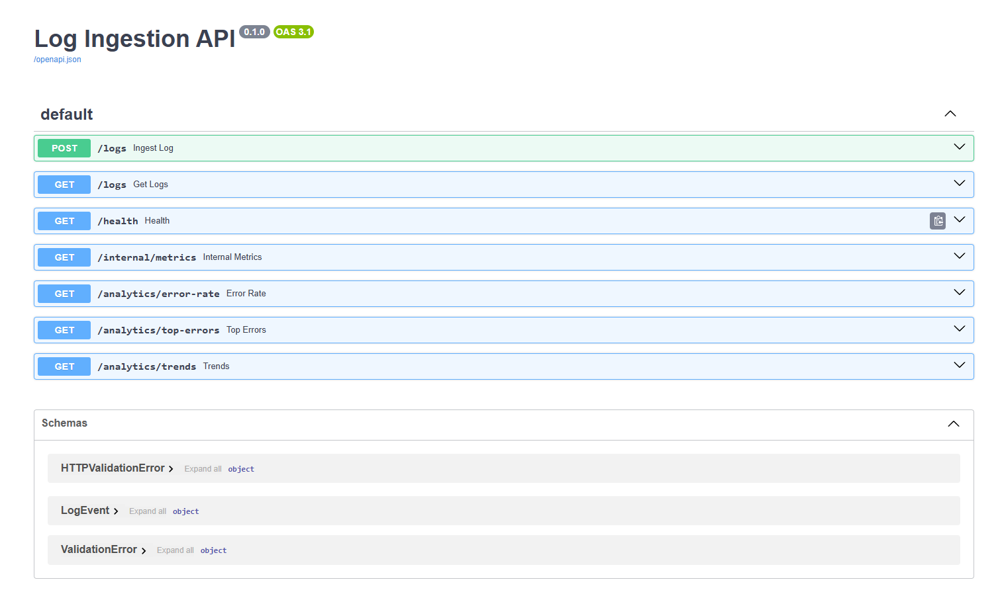
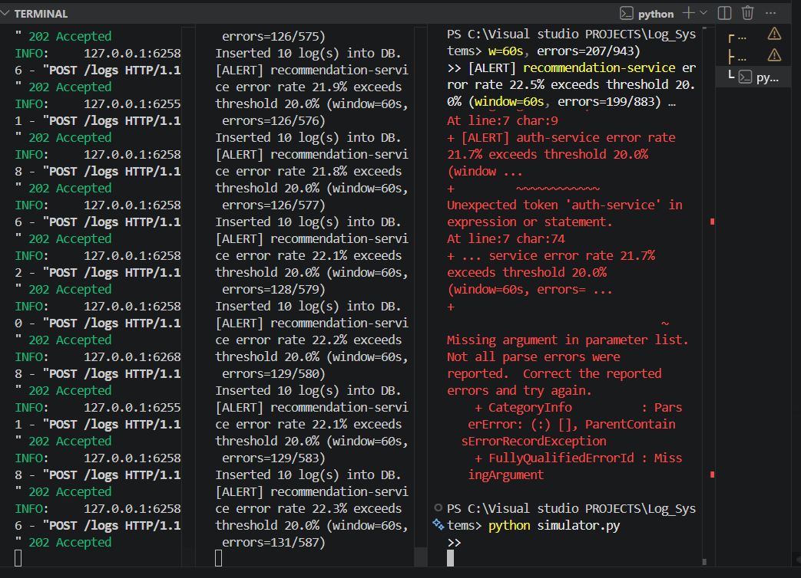
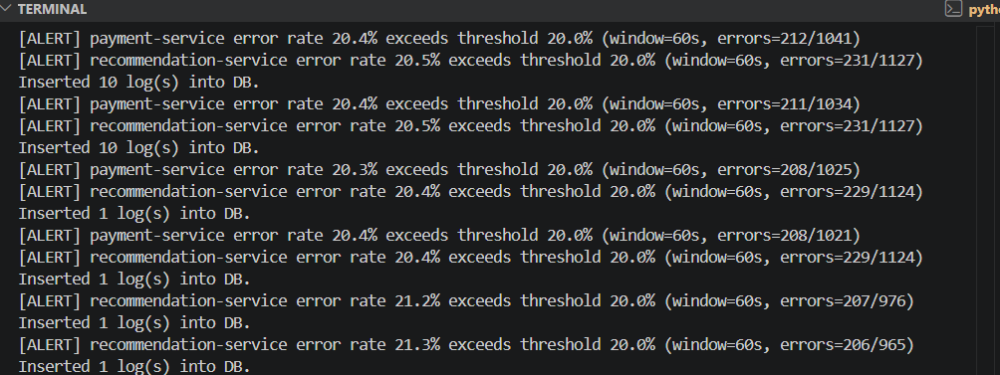
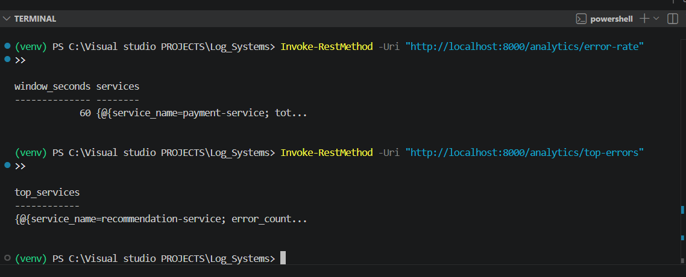
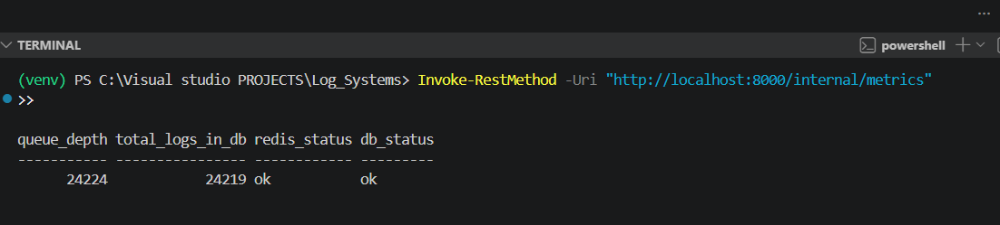

# Distributed Log Processing & Analytics System

A production-style log ingestion and analytics platform built with FastAPI, Redis Streams, and PostgreSQL — inspired by ELK Stack, Datadog, and Splunk.

## Architecture

```
Producers → FastAPI → Redis Streams → Worker → PostgreSQL → Analytics API
```
## Screenshots

### API Documentation


### Load Test Results


### Real-Time Alerts


### Analytics Endpoints


### Internal Metrics



## Tech Stack

| Component | Technology |
|---|---|
| Ingestion & Query API | FastAPI (Python) |
| Message Queue | Redis Streams |
| Storage | PostgreSQL |
| Worker | Python (sync) |
| Load Simulator | Python + httpx async |
| Infrastructure | Docker Compose |

## Performance

| Metric | Result |
|---|---|
| Ingestion throughput | 343 logs/sec |
| Latency P50 | 10ms |
| Latency P99 | 268ms |
| Total logs processed | 10,000+ |
| Alert detection latency | <5 seconds |

## Quick Start

**Requirements:** Docker, Python 3.8+

**1. Start infrastructure:**
```bash
docker compose up -d
```

**2. Create the database table:**
```bash
docker exec -it log_systems-postgres-1 psql -U loguser -d logsdb -f /init_db.sql
```

**3. Install dependencies:**
```bash
python -m venv venv
venv\Scripts\Activate.ps1
pip install -r requirements.txt
```

**4. Start the API:**
```bash
uvicorn app.main:app --reload
```

**5. Start the worker:**
```bash
python worker.py
```

**6. Send a log:**
```bash
curl -X POST http://localhost:8000/logs \
  -H "Content-Type: application/json" \
  -d '{"service_name":"auth-service","log_level":"ERROR","message":"Login failed","timestamp":"2026-05-04T12:00:00Z"}'
```

## API Endpoints

| Method | Endpoint | Description |
|---|---|---|
| POST | `/logs` | Ingest a log event |
| GET | `/logs` | Query logs with filters |
| GET | `/analytics/error-rate` | Error % per service |
| GET | `/analytics/top-errors` | Top failing services |
| GET | `/analytics/trends` | Logs per minute + spike detection |
| GET | `/health` | System health check |
| GET | `/internal/metrics` | Queue depth + DB stats |

## Key Engineering Decisions

- **Redis Streams over Kafka** — same consumer group semantics, zero ops overhead for a single-node setup
- **Eventual consistency** — logs appear in query results after async worker processing (~1s lag)
- **Idempotent inserts** — `ON CONFLICT (log_id) DO NOTHING` prevents duplicates on worker retry
- **Backpressure handling** — Redis buffers bursts without dropping messages
- **Per-service alerting** — error rate checked after every batch, fires within one processing cycle

## Load Test

```bash
python simulator.py
```

Simulates 500 logs/sec for 30 seconds across 3 services with realistic INFO/WARNING/ERROR distribution.
